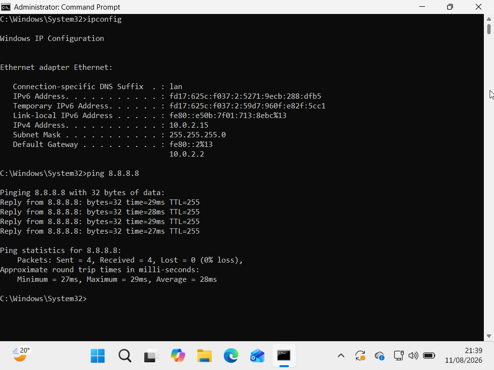
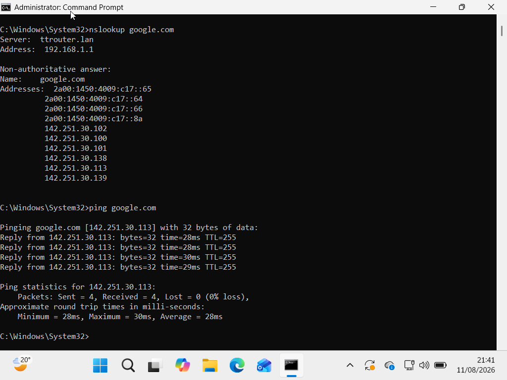
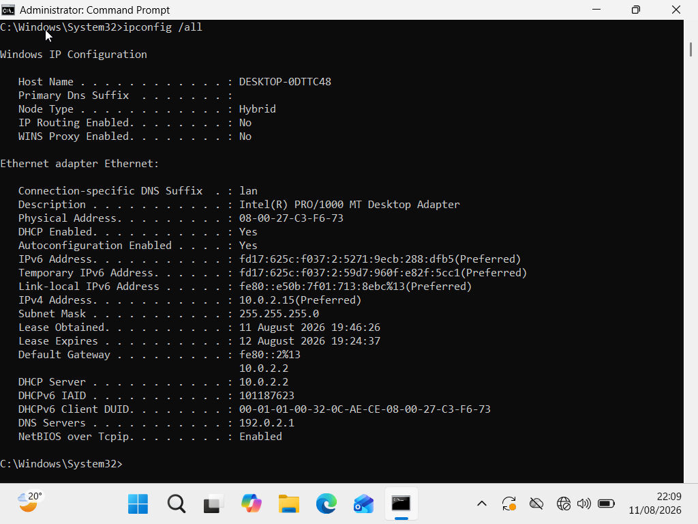
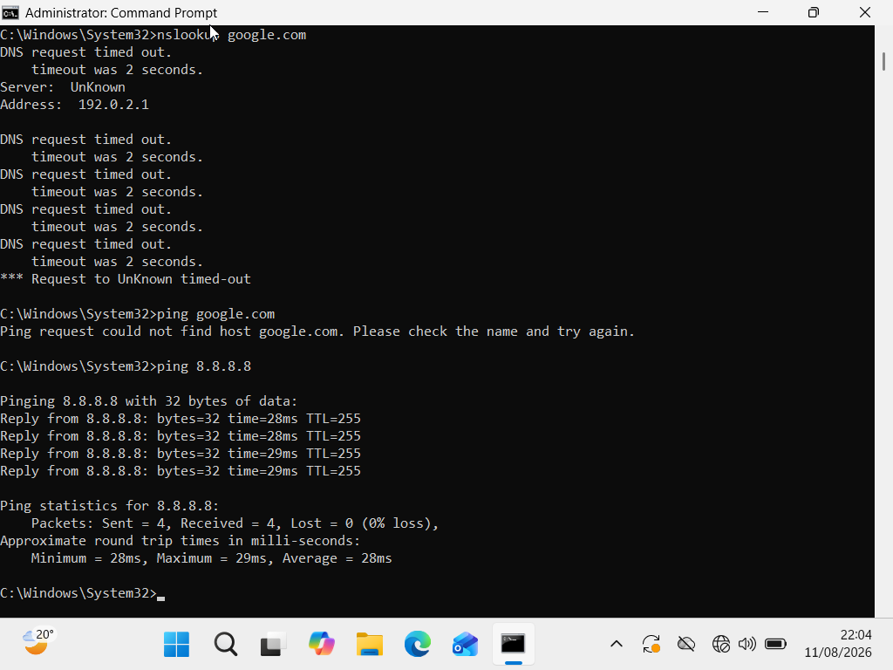
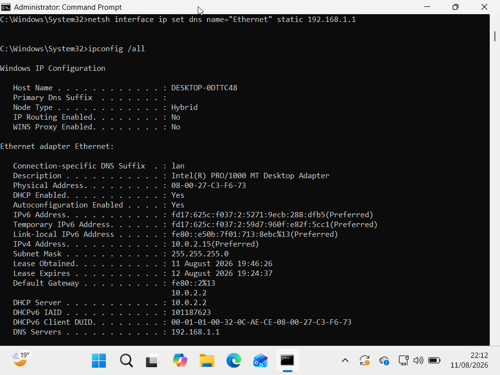
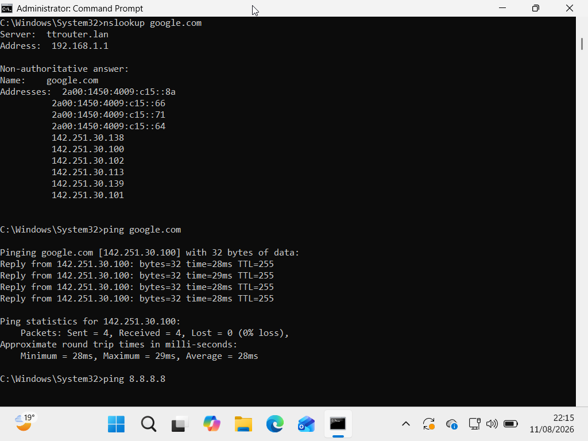

# Lab 02 — Windows DNS Troubleshooting

## Scenario

A user reported that they were unable to access websites using domain names.

I deliberately created the issue in a controlled Windows 11 virtual machine to practise troubleshooting a common IT Support DNS problem.

The purpose of the exercise was to distinguish between a general network connectivity problem and a DNS resolution problem.

## Environment

* **Operating System:** Windows 11
* **Virtualisation Platform:** Oracle VirtualBox
* **Network Adapter:** Ethernet
* **Administrator Account:** `admm`
* **DNS Server:** `192.168.1.1`
* **Tool:** Command Prompt

---

## 1. Problem

The Windows 11 virtual machine initially had working network and DNS connectivity.

I first established a working baseline before deliberately creating a DNS problem.

The VM was able to communicate with external IP addresses and resolve domain names successfully.

---

## 2. Initial Network Check

I opened Command Prompt with administrator privileges and checked the network configuration using:

```cmd
ipconfig
```

I then tested connectivity to an external IP address:

```cmd
ping 8.8.8.8
```

The result showed:

```text
Sent = 4
Received = 4
Lost = 0%
Minimum = 27 ms
Maximum = 29 ms
Average = 28 ms
```

This confirmed that the VM had working network connectivity.

### Evidence



---

## 3. Initial DNS Check

I tested DNS resolution using:

```cmd
nslookup google.com
```

The command successfully returned IP addresses for `google.com`.

I then tested the domain using:

```cmd
ping google.com
```

The ping was successful with:

```text
Sent = 4
Received = 4
Lost = 0%
Minimum = 28 ms
Maximum = 30 ms
Average = 28 ms
```

This confirmed that DNS resolution was initially working.

### Evidence



---

## 4. Creating the Problem

I checked the current DNS configuration using:

```cmd
ipconfig /all
```

The active Ethernet adapter was using:

```text
DNS Server: 192.168.1.1
```

I then deliberately changed the DNS server configuration to an invalid/unreachable test address:

```cmd
netsh interface ip set dns name="Ethernet" static 192.0.2.1
```

Windows reported that the configured DNS server was incorrect or did not exist, but the configuration was changed.

I verified the configuration using:

```cmd
ipconfig /all
```

The DNS server was now shown as:

```text
192.0.2.1
```

### Evidence



---

## 5. Investigating the DNS Problem

I tested DNS resolution using:

```cmd
nslookup google.com
```

The request timed out.

I then tested the domain using:

```cmd
ping google.com
```

The command reported that the host could not be found.

To determine whether the problem was DNS-specific rather than a general network connectivity problem, I tested the external IP address directly:

```cmd
ping 8.8.8.8
```

The result showed:

```text
Sent = 4
Received = 4
Lost = 0%
Minimum = 28 ms
Maximum = 29 ms
Average = 28 ms
```

This was important because the VM could still reach an external IP address, while domain-name resolution was failing.

### Evidence



---

## 6. Root Cause

The network connection itself was working, but DNS resolution was failing.

The investigation showed that the Ethernet adapter had been configured to use:

```text
192.0.2.1
```

as its DNS server.

This prevented Windows from resolving domain names such as `google.com`.

### Root Cause

**Incorrect DNS server configuration on the Ethernet adapter.**

---

## 7. Fix

I restored the original DNS server configuration:

```cmd
netsh interface ip set dns name="Ethernet" static 192.168.1.1
```

I then checked the configuration using:

```cmd
ipconfig /all
```

The DNS server was restored to:

```text
192.168.1.1
```

### Evidence



---

## 8. Verification

I tested DNS resolution again using:

```cmd
nslookup google.com
```

The command successfully returned an IP address for `google.com`.

I then tested connectivity using:

```cmd
ping google.com
```

The domain resolved successfully and the ping completed successfully.

I also confirmed that direct IP connectivity remained available using:

```cmd
ping 8.8.8.8
```

The tests confirmed that DNS resolution had been restored.

### Evidence



---

## 9. Troubleshooting Summary

| Stage               | Action                                | Result                                      |
| ------------------- | ------------------------------------- | ------------------------------------------- |
| **Baseline**        | Tested `ping 8.8.8.8`                 | Network connectivity working                |
| **DNS Check**       | Used `nslookup google.com`            | DNS resolution working                      |
| **Problem Created** | Changed DNS server to `192.0.2.1`     | DNS failure created                         |
| **Investigation**   | Tested DNS and direct IP connectivity | DNS failed while network remained available |
| **Root Cause**      | Checked DNS configuration             | Incorrect DNS server identified             |
| **Fix**             | Restored DNS server to `192.168.1.1`  | DNS configuration corrected                 |
| **Verification**    | Tested `nslookup` and `ping` again    | DNS and connectivity restored               |

---

## 10. Commands Used

### View IP configuration

```cmd
ipconfig
```

### View detailed network configuration

```cmd
ipconfig /all
```

### Test connectivity to an IP address

```cmd
ping 8.8.8.8
```

### Test DNS resolution

```cmd
nslookup google.com
```

### Test connectivity using a domain name

```cmd
ping google.com
```

### Configure the DNS server

```cmd
netsh interface ip set dns name="Ethernet" static 192.168.1.1
```

### Configure the test DNS server used to create the problem

```cmd
netsh interface ip set dns name="Ethernet" static 192.0.2.1
```

---

## 11. Tools Used

* Windows 11
* Oracle VirtualBox
* Command Prompt
* `ipconfig`
* `ping`
* `nslookup`
* `netsh`
* Windows network configuration

---

## 12. Skills Demonstrated

* Windows network troubleshooting
* DNS troubleshooting
* IP connectivity testing
* DNS resolution testing
* Command-line troubleshooting
* Network configuration
* Root-cause identification
* Troubleshooting methodology
* Problem resolution
* Verification and testing
* Technical documentation

---

## 13. Key Learning

This exercise demonstrated the importance of distinguishing between a general network connectivity problem and a DNS resolution problem.

The VM was able to communicate with an external IP address while DNS resolution was failing. This helped isolate the problem to the DNS configuration rather than the underlying network connection.

The incorrect DNS server was identified, the original DNS configuration was restored, and successful DNS resolution was confirmed through `nslookup` and `ping`.

The troubleshooting process followed:

**Baseline → Problem → Investigation → Root Cause → Fix → Verification**

